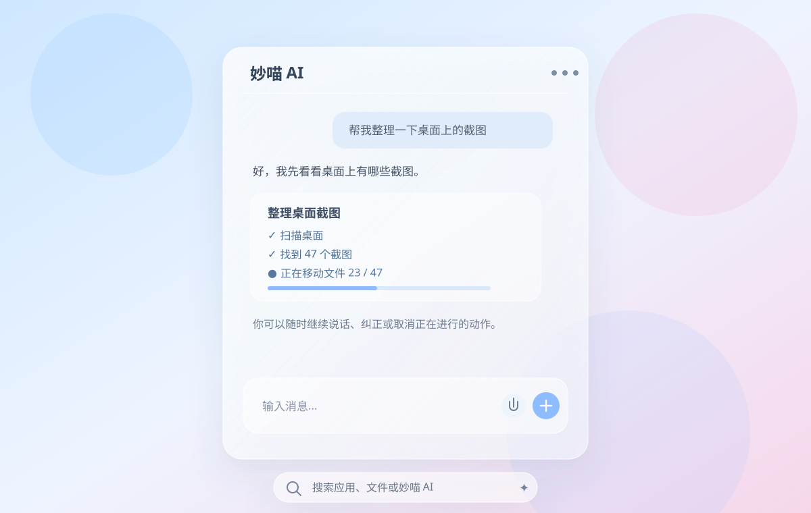

# TuringDesk Glass UI Design Language

> Status: approved visual baseline
>
> Scope: Search Bar, Pi Conversation Panel, floating toolbars, activity cards, confirmation cards, compact desktop overlays, Widget chrome and future lightweight native UI surfaces.

## 1. Visual reference



Related approved references:

- `docs/design/search-bar-reference.jpg`
- `docs/SEARCH_BAR_VISUAL_SPEC.md`
- `docs/WINDOWS_LAYERED_DIRECT2D_UI_RENDERING.md`
- `docs/PI_AGENT_CONVERSATION_UX.md`
- `docs/PI_AGENT_ACTIVITY_FEEDBACK.md`

The reference image is not a one-off mock. It defines the shared visual family for future TuringDesk lightweight UI.

## 2. Product character

TuringDesk UI should feel:

- light rather than dark;
- calm rather than technical;
- translucent rather than opaque;
- desktop-native rather than web-dashboard-like;
- soft and friendly rather than enterprise/admin-console-like;
- minimal, with only the controls needed for the current task;
- visually consistent with the approved Search Bar.

The target impression is a modern macOS-like light glass language implemented with native Windows rendering, without copying macOS controls or branding.

## 3. Core material

Primary floating surfaces use a light frosted-glass treatment:

- translucent white fill;
- clean per-pixel antialiased silhouette;
- subtle directional white edge highlight;
- soft low-contrast shadow;
- optional restrained blue focus glow;
- desktop/background color should remain perceptible through the surface.

Do not make the material look like:

- flat opaque gray;
- dark acrylic;
- a Windows settings panel;
- a browser card stack;
- a thick neon-glow gaming UI.

## 4. Rendering baseline

For native floating surfaces that require pixel-clean transparency and rounded edges, use the approved implementation documented in `docs/WINDOWS_LAYERED_DIRECT2D_UI_RENDERING.md`:

```text
WS_EX_LAYERED HWND
    -> 32-bit top-down DIB
    -> ID2D1DCRenderTarget
    -> PREMULTIPLIED alpha
    -> Direct2D PER_PRIMITIVE antialiasing
    -> UpdateLayeredWindow(... ULW_ALPHA)
```

Visible rounded edges must have one rendering owner. Do not combine `SetWindowRgn` / `CreateRoundRectRgn` with the Direct2D visible silhouette.

## 5. Shape language

### Search / compact bars

- full pill shape;
- height-driven radius: usually `height / 2`;
- minimal chrome;
- icons vertically centered;
- 1 px visual border intent.

### Conversation / floating panels

- rounded rectangle, approximately 22–28 logical px radius depending on size;
- generous internal padding;
- no heavy title bar;
- header visually merges with the glass panel;
- content cards use smaller radii than the outer panel.

### Activity / confirmation cards

- nested glass or lightly tinted translucent cards;
- 16–20 px radius range;
- state is communicated by text, icon and subtle tint rather than thick colored borders.

## 6. Color hierarchy

Preferred palette family:

- glass: translucent white;
- primary text: soft charcoal / blue-gray, approximately `#374151` family;
- secondary text/icons: approximately `#6B7280` family;
- accent: calm Windows-compatible blue, approximately `#4285F4` / `#5B9CFF` family;
- separators: very low-opacity dark line;
- success: restrained green;
- warning: restrained amber;
- failure: restrained red;

Color must support hierarchy, not decorate every object.

## 7. Border and highlight language

Default glass borders are not simple flat gray strokes.

Use:

1. primary translucent white edge;
2. optional directional/top-left highlight;
3. state outline only when Hover/Focused/Active semantics require it.

State behavior should remain consistent across surfaces:

```text
Default  -> quiet white glass edge
Hover    -> slightly brighter edge/material
Focused  -> thin blue outline + very soft halo
Active   -> slightly stronger blue outline/halo
```

Avoid thick outlines and saturated glows.

## 8. Typography

Use native Windows typography first:

- `Segoe UI Variable Text` when available;
- `Segoe UI` fallback;
- normal body weight for chat content;
- semibold only for concise titles/task names;
- avoid excessive size variation.

Text must remain readable over light glass. Placeholder text may be softer, but never so faint that it disappears in the default state.

## 9. Icon language

Icons should be:

- simple line icons;
- visually about 18–22 px for compact surfaces;
- low visual weight;
- same blue-gray family as secondary text;
- accent blue only for active/primary actions.

Do not mix multiple unrelated icon styles in one surface.

## 10. Conversation Panel language

The Pi Conversation Panel is a continuation of the Search Bar, not a separate app window.

Visual rules:

- same glass material family;
- same text/icon color hierarchy;
- outer panel around ~560 logical px wide for first implementation;
- header is quiet: `图灵 AI`, optional status and compact menu;
- user messages may use a slightly tinted light bubble;
- Pi text may sit directly on glass or in a very subtle bubble;
- activity cards are distinct but visually quieter than messages;
- composer is a nested rounded glass surface;
- Send is the clearest accent action;
- microphone/attachment are secondary actions.

The panel should feel like messaging a capable contact, not operating a terminal.

## 11. Pi activity feedback language

Pi work state must be visible, but the UI must not expose private chain-of-thought.

Use short natural status copy such as:

```text
正在理解你的需求…
正在检查当前桌面…
正在搜索截图文件…
正在移动文件 23 / 47
正在等待 Windows 完成操作…
刚才没有成功，正在重试…
```

Long tasks should update one stateful card rather than flood the timeline.

## 12. Motion

Motion should be subtle and functional:

- open/collapse: short fade + scale/vertical translation;
- hover: fast material/border interpolation;
- streamed text: content growth, not typewriter theatrics;
- activity progress: smooth state transition;
- no bouncing, elastic overshoot or decorative looping animation in the primary productivity UI.

Respect reduced-motion settings when available.

## 13. Layering and spacing

Use clear depth hierarchy:

```text
Desktop/background
    -> Search Bar / Conversation Panel glass
        -> nested message/activity/composer surfaces
            -> text/icons/actions
```

Nested surfaces should be subtler than the parent; do not create a stack of opaque cards.

Spacing should feel generous:

- outer panel padding roughly 20–28 px;
- message/card gaps roughly 12–18 px;
- icon-to-label gaps roughly 10–16 px;
- avoid dense control clusters.

## 14. What must not return

Do not reintroduce the visual patterns that were removed from the earlier product UI:

- large legacy settings-style control grids in the primary surface;
- terminal output as normal Pi UI;
- opaque gray Win32 EDIT rectangles;
- hard GDI-rounded corners;
- dense permanent toolbars;
- multiple visual systems competing on the same screen;
- decorative UI that obscures the user's wallpaper.

## 15. Reuse targets

This design language should be considered the default starting point for:

- Search Bar;
- Pi Conversation Panel;
- Pi activity cards;
- confirmation cards;
- Widget status/quick controls;
- compact wallpaper quick actions;
- floating desktop toolbar;
- future notification/toast surfaces owned by TuringDesk.

Large settings/library pages may use a more structured information architecture, but should still inherit typography, radii, color hierarchy and lightweight glass details where appropriate.

## 16. Acceptance rule

A new TuringDesk surface should not be called visually complete merely because it compiles or approximately matches these numbers.

For visible milestones:

1. compare against the approved reference assets;
2. verify real ARM64 Windows rendering;
3. inspect edge quality at 1:1 pixels;
4. verify readable default/hover/focus states;
5. verify it visually belongs to the same family as the Search Bar;
6. only then treat it as the accepted baseline for that surface.
